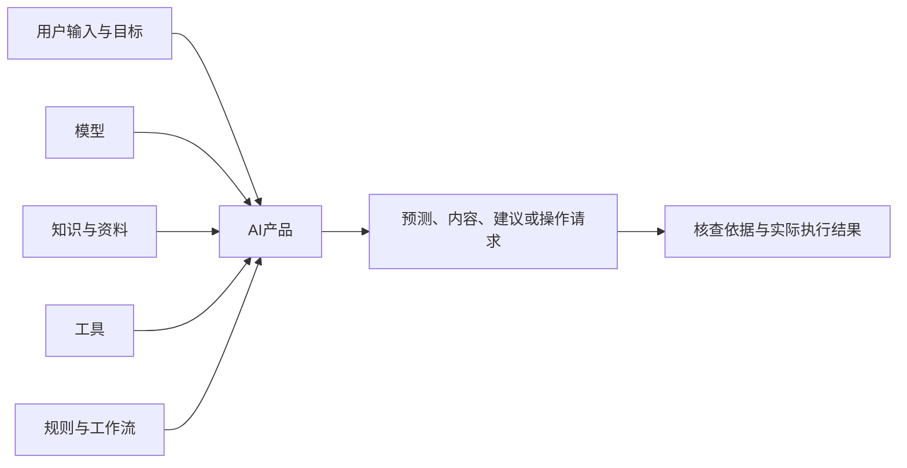

# AI全景图

```mermaid
flowchart LR
 IN[用户输入与目标] --> PRODUCT[AI产品]
 MODEL[模型] --> PRODUCT
 DATA[知识与资料] --> PRODUCT
 TOOL[工具] --> PRODUCT
 RULE[规则与工作流] --> PRODUCT
 PRODUCT --> OUT[预测、内容、建议或操作请求]
 OUT --> CHECK[核查依据与实际执行结果]
```

模型是产品的一部分。外部工具能执行的操作取决于权限与实际连接；模型说完成不等于外部系统已完成。

概念层级见[[03-知识地图/第一周知识关系图|第一周关系图]]，生成过程见[[03-知识地图/大模型知识地图|大模型知识地图]]。
