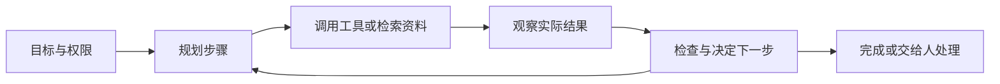

# 智能体知识地图（后续方向）

这部分属于第9—10周路线，本预览未提供完整每日课程。

```mermaid
flowchart LR
 G[目标与权限] --> PLAN[规划步骤]
 PLAN --> CALL[调用工具或检索资料]
 CALL --> RESULT[观察实际结果]
 RESULT --> CHECK[检查与决定下一步]
 CHECK --> PLAN
 CHECK --> FINISH[完成或交给人处理]
```

是否需要智能体，要看任务是否需要动态决定步骤。已有Obsidian文件不等于已经建成RAG系统；需要实际检索相关资料并用于生成，才能讨论检索增强的流程。

[[02-学习路线/第五模块-知识库与智能体|后续模块方向]]
